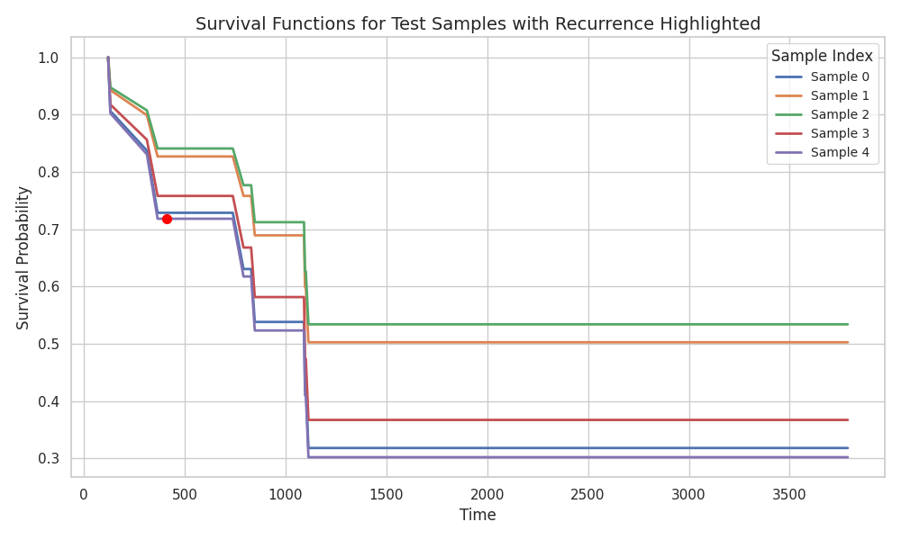

# **Training Methodology Report**  
## **Predicting HCC Recurrence using a Cox PH Model with DINOv2 Features**  

### **1. Introduction**  
 This report outlines the methodology used in training a time-to-event survival analysis model based on deep learning features extracted from DINOv2. The model employs a Cox Proportional Hazards (CoxPH) approach with an MLP

---

### **2. Our Dataset**  
The dataset consists of **122 patients** split into training, validation, and test sets 

| Dataset | Total Patients | Positive Cases (Recurrence) |
|---------|---------------|----------------------------|
| Train   | 85            | 6                          |
| Validation | 18         | 2                          |
| Test    | 19            | 1                          |

I make sure that each split contains at least one positive case.

Also, Given the high class imbalance, upsampling strategy was applied -- positive cases were repeated, so that the final train dataset has 50% recurrence and 50% non-recurrence.

---

### **3. Feature Extraction using DINOv2**  
A pre-trained DINOv2 model from last semester was used to extract image features of dimension 768

---

### **4. Training Methodology**  
### **4.1 Model Architecture**

The survival analysis model is based on a **Cox Proportional Hazards (CoxPH) model**, which predicts the risk of an event (e.g., recurrence) occurring over time.

1. **Feature Extraction (DINOv2)**
   - A pre-trained **DINOv2 ViT-B/14** model processes image slices, converting them into high-dimensional feature embeddings.
   - The extracted token embeddings are pooled to form a single feature vector (768)per slice.

2. **Survival Regression Model**
   - The extracted image features are input into a **Custom Multi-Layer Perceptron (MLP)** 
   - The **MLP consists of three layers**: 768 - 512 - 128 - 1

3. **Regularization**
    - added L1 and L2 for regularization.

#### **4.2 Training Procedure**  

The model was trained for **500 epochs** with an early stopping mechanism to prevent overfitting.

---

### **5. Evaluation Metrics and Performance**  
The model's performance was evaluated using standard survival analysis metrics:

1. **Partial Log-Likelihood on Validation Set:** `-2.560573`
2. **Concordance Index (C-Index):** `0.8571`
   - Measures the discriminative ability of the model. A value closer to **1.0** indicates better performance.

---

### **6. Visualization of Model Training and Survival Functions**  

#### **6.1 Training Loss Over Epochs**  
The plot below illustrates the **training loss progression**, highlighting the model’s convergence over **384 epochs** before early stopping.

#### **6.2 Survival Probability Predictions**  
Survival functions were computed for individual patients in the test set. The plot below presents Kaplan-Meier estimates and predicted survival curves.

recurrence events were annotated with red markers to indicate actual occurrences.

---

#### **Potential Future Improvements:**
- Test on external HCC datasets
- Experiment different pooling methods. Try attention pooling instead of directly feeding dinov2 outptus to mlp
- Visualize regions where the model attend to

---