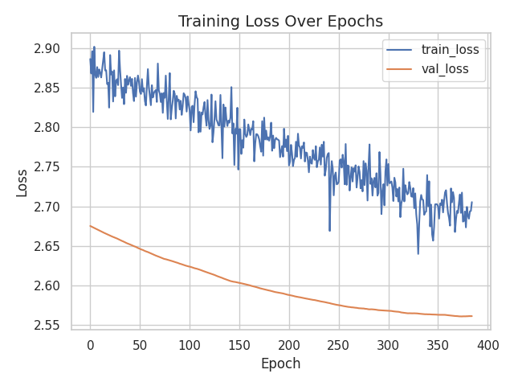

# **Training Methodology Report**  

## **Predicting HCC Recurrence using a Cox PH Model with DINOv2 Features**  

### **1. Introduction**  

This report outlines the methodology used in training a time-to-event survival analysis model based on deep learning features extracted from DINOv2. The model employs a Cox Proportional Hazards (CoxPH) approach with an MLP

---

### **2. Our Dataset** 

#### **2.1 Splitting**
The dataset consists of **122 patients** split into training, validation, and test sets 

| Dataset | Total Patients | Positive Cases (Recurrence) |
|---------|---------------|----------------------------|
| Train   | 85            | 6                          |
| Validation | 18         | 2                          |
| Test    | 19            | 1                          |

I make sure that each split contains at least one positive case.

#### **2.2 Preprocessing**

- **DICOM Image Loading**: Images are loaded from the, and the axial series is identified using ImageOrientationPatient metadata. so that only axial images were used in training

- **Sorting Slices**: The slices are sorted based on SliceLocation or ImagePositionPatient[2] to ensure they are in the correct anatomical order.

- **Conversion to Tensor**:
The pixel array is converted to a PyTorch tensor.
For grayscale, it is expanded to three channels--Similar to what we done last semester in the 

#### **2.3 Upsampling**

Given the high class imbalance, upsampling strategy was applied -- positive cases were repeated, so that the final train dataset has 50% recurrence and 50% non-recurrence.

---

### **3. Feature Extraction using DINOv2**  

A pre-trained DINOv2 model from last semester was used to extract image features of dimension 768 by averaging the patch embeddings

After that, image features of different slices were further average polled

I maintained a option of `num_slices` to specify how many slices were used per patient 

---

### **4. Training Method**  
### **4.1 Model Architecture**

The survival analysis model is based on a **Cox Proportional Hazards (CoxPH) model**, which predicts the risk of an event occurring over time.

1. **Feature Extraction (DINOv2)**
   - A pre-trained **DINOv2 ViT-B/14** model (dimension 768) processes image slices, converting them into high-dimensional feature embeddings.
   - The extracted token embeddings are pooled to form a single feature vector per slice. Here I average pooled the patch embeddings.

2. **Survival Regression Model**
   - The extracted image features are input into a **Custom Multi-Layer Perceptron (MLP)** 
   - The **MLP consists of three layers**: 768 - 512 - 128 - 1

3. **Regularization**
    - added L1 and L2 for regularization to stable leanring loss

### **4.2 Training Procedure**  

The model was trained for around **500 epochs** with an early stopping mechanism to prevent overfitting.

---

### **5. Evaluation Metrics and Performance**  
The model's performance was evaluated using standard survival analysis metrics:

1. **Concordance Index (C-Index):** `0.8571`
   - Measures the discriminative ability of the model. A value closer to **1.0** indicates better performance.

2. **Brier Score over Time**

---

### **6. Visualization of Model Training and Survival Functions**  

#### **6.1 Training Loss Over Epochs**  
The plot below illustrates the **training loss progression**, highlighting the model’s convergence over **384 epochs** before early stopping.

**Overfit**: If I further train this model without early stoping, then the training loss will continue to go down and the validation loss will go up.

#### **6.2 Survival Probability Predictions**  
Survival functions were computed for individual patients in the test set. The plot below presents Kaplan-Meier estimates and predicted survival curves.

recurrence events were annotated with red markers to indicate actual occurrences.

---

### **7. Problems**

#### **7.1 Nan Loss**

During the training, the loss was nan initially. I tried different things like 

- L1, L2, regularization
- dropout 
- center risk

However, this was eventually solved with upsampling, simply repeating recurrence cases.

#### **Potential Future Improvements:**
- Test on external HCC datasets
- Experiment different pooling methods. Try attention pooling instead of directly feeding dinov2 outptus to mlp
- Visualize regions where the model attend to
- cross validation
- advanced upsampling methods like SMOTE

---