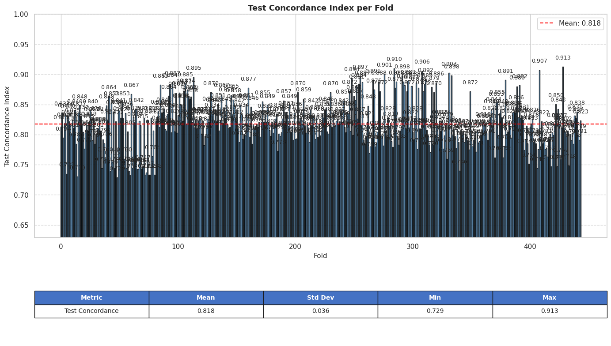
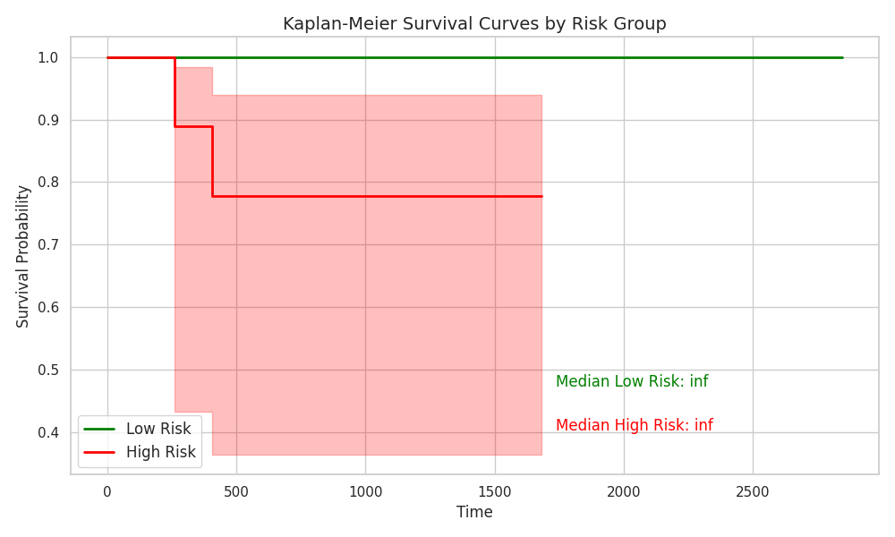

# Meeting Update: HCC Recurrence Prediction

#### Date: March 24, 2025

## Our Dataset

| Dataset               | Total Patients | Positive Cases (Recurrence) |
| --------------------- | -------------- | --------------------------- |
| NYU (Transplant)      | 122            | 9                           |
| TCGA-LIHC (Resection) | 322            | 147                         |

## Performance Results:

### Leave-One-Out Cross-Validation (LOOCV)

| Dataset                        | Mean Concordance |Min Concordance | Max Concordance | Std. Dev. |
| ------------------------------ | -------- | -------------- | -------------- | ----------- |
| Combined (444 patients)        | 0.818     | 0.729          | 0.913          | 0.036       |
| Resection only (322 patients)  | 0.732     | 0.479          | 0.881          | 0.077       |
| Transplant only (122 patients) | 0.855     | 0.759          | 0.906          | 0.027       |

### Cross-group Testing

| Training Set     | Testing Set      | Concordance |
| ---------------- | ---------------- | -------- |
| Resection (322 )  | Transplant (122) | 0.70     |
| Transplant (122) | Resection (322)  | TBD      |

## LOOCV Visualization: 

### LOOCV Combined

### LOOCV Resection

### LOOCV Transplant

### Cross-group Testing
