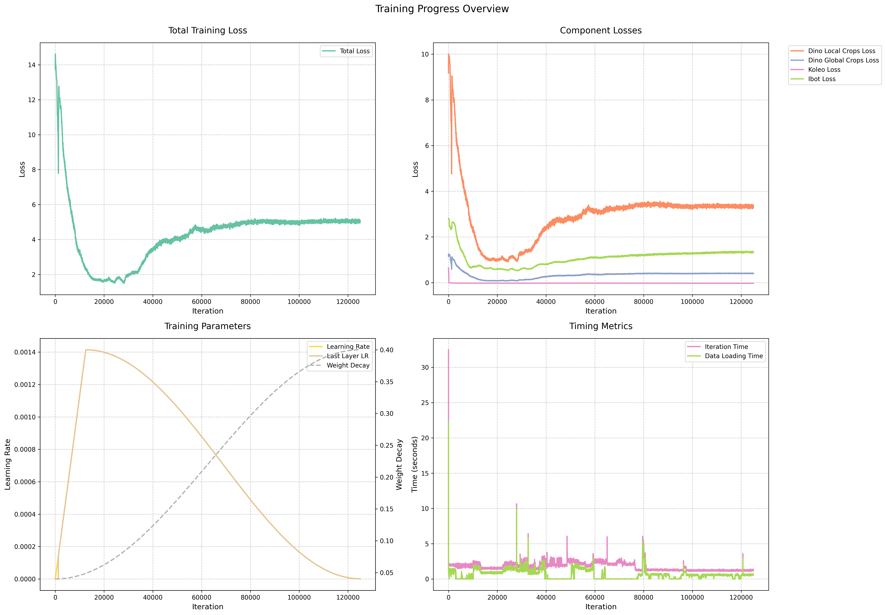
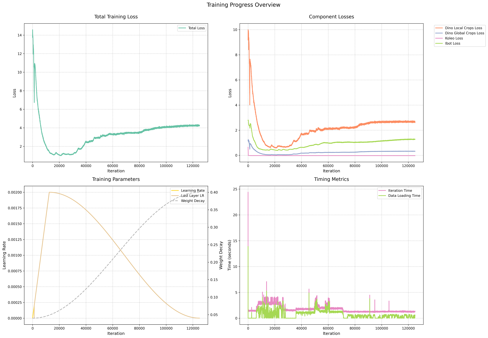

## Dataset Overview

### Self-Supervised Learning (SSL) Datasets

- **[LLD-MMRI Dataset](https://github.com/LMMMEng/LLD-MMRI-Dataset)**: Open-access dataset for liver lesion diagnosis using multi-phase MRI, with 498 cases across 7 lesion types, totaling approximately 220,000 images.

- **[AMOS Dataset](https://arxiv.org/abs/2206.08023)**: Large-scale benchmark for abdominal multi-organ segmentation, comprising 500 CT and 100 MRI scans with annotations across 15 abdominal organs.

- **[LiverHCCSeg Dataset](https://www.sciencedirect.com/science/article/pii/S2352340923007473)**: Contains 17 cases of hepatocellular carcinoma (HCC) with comprehensive annotations.

- **[CHAOS Dataset](https://chaos.grand-challenge.org/)**: Combined CT-MR dataset for healthy abdominal organ segmentation, including 40 CT and 120 MRI volumes with annotations for liver, kidneys, and spleen.

Together, these datasets provide approximately **330,000 MRI images** for SSL tasks.

### Classification Benchmark

- **[Duke Liver Dataset](https://scholars.duke.edu/publication/1589665)**: A liver MRI dataset with segmentation masks and series labels, containing 2,146 abdominal MRI series from 105 patients, including 310 image series with manually segmented liver masks.

### Evaluation Methodology

The evaluation framework uses **52 linear classifiers** on frozen DINOv2 features to assess representation quality, exploring configurations that vary in:

1. **Blocks Used**: Either the last 1 or the last 4 blocks.
2. **Average Pooling**: Configurations with and without pooling.
3. **Learning Rates**: 13 distinct values ranging from 1e-5 to 0.1.

The classifier performance is measured by accuracy, selecting the best-performing configuration for the final assessment. Both a randomly initialized model and a pretrained model were evaluated under this configuration. The random model struggled to converge, unlike the pretrained model.

---

## Progress Updates

### Last Week

- **SSL on LLD-MMRI Dataset**: Trained with **220,000 images** for **12,500 epochs** over 2.5 days with 1 node two A100 GPUs.
  
  **Results**:
  - An early epoch (12,499) model mistakenly evaluated, yielded **0.82 accuracy**.
  - Final epoch model reached **0.866 accuracy**.

**Performance Comparison**:
- **Random Model**: 0.22 accuracy
- **Pretrained Model**: 0.85 accuracy

*Note: All models were evaluated using the same 52 linear classifier configurations as outlined above.*

### This Week

- **Expanded SSL** to include all datasets (LLD-MMRI, AMOS, LiverHCCSeg, CHAOS) totaling **330,000 images**, trained for **12,500 epochs**.

  **Results**:
  - **DINOv2** (1 node, 2 A100 GPUs, 2.5 days): **0.869 accuracy**
  - **DINOv2 with Registers** (1 node, 4 A100 GPUs, ~3 days): **0.875 accuracy**

#### Training Status Visuals

Below are the training status visuals for DINOv2 and DINOv2 with Registers:

*Figure 1: Training Status for DINOv2*

*Figure 2: Training Status for DINOv2 with Registers*

